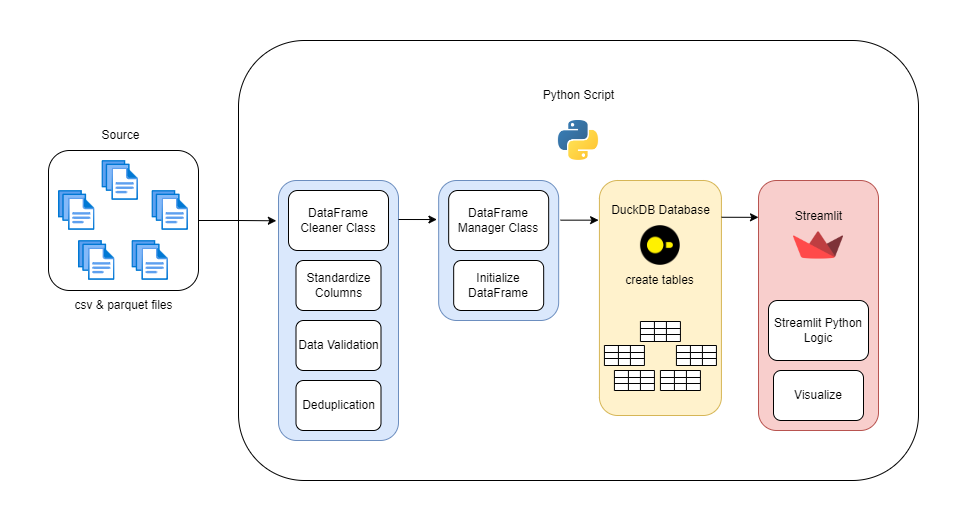

# blood-donation-pipeline-v2
Welcome to my github repo! You can access the webpage via my website: itsmejoeyong.com

This is the blood-donation-pipeline-v2 branch of my streamlit portfolio, this branch is essentially a copy from the main repository of my other project:
https://github.com/itsmejoeyong/blood-donation-pipeline-v2
> for more info you can head to that specific repo

This branch's main concern is organize the contents so that it can integrate well with the main branch.

```

```

---
### Workflow


### NOTE
I'm aware that the analysis on nearly 10 million rows takes a bit of time, looking to implement a datamart implementation on pipeline.py's runtime to get the aggregated values. App would only need to filter the result set.